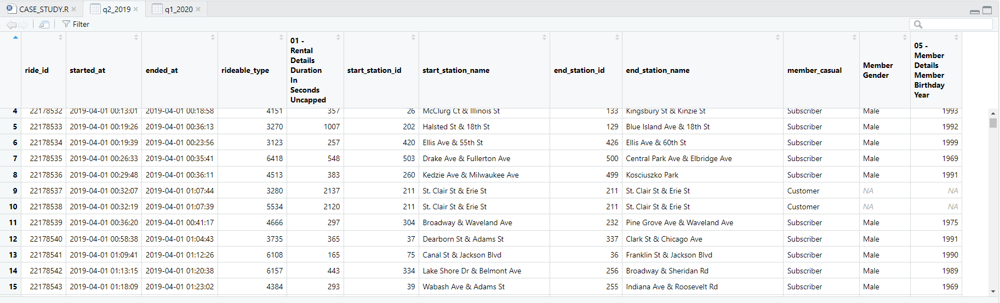
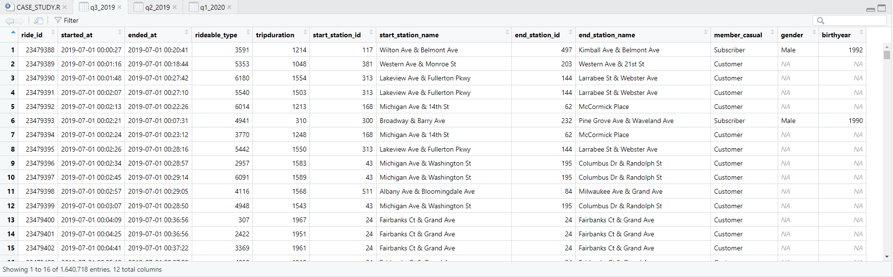
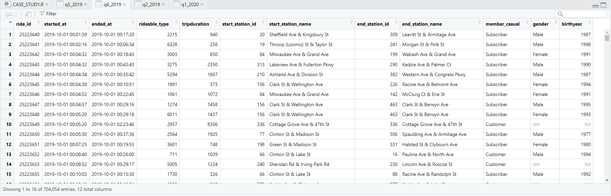
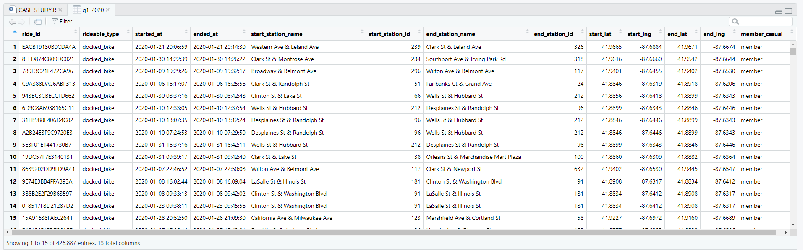
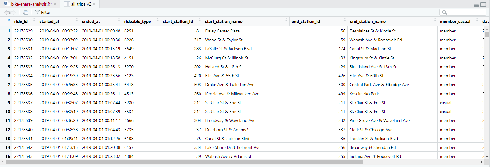
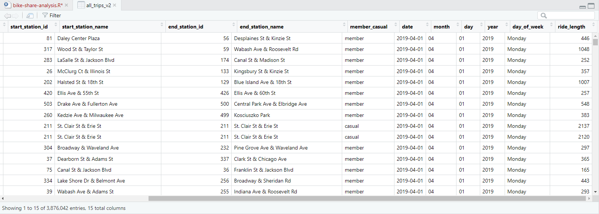
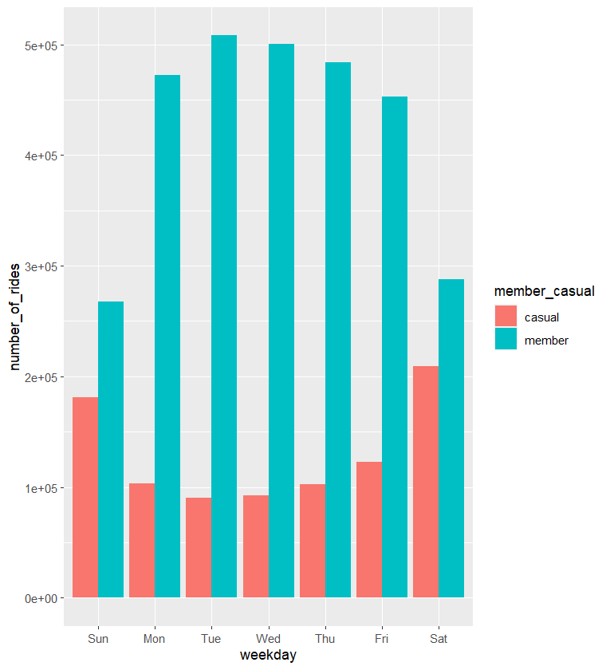
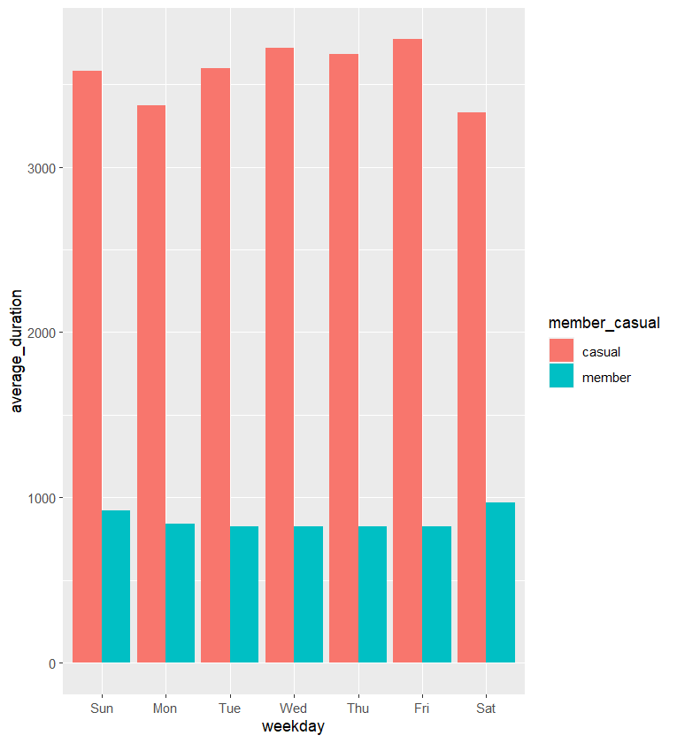

# Bike Share Analysis

*Review the R Script:* **[HERE](https://github.com/jamiedeocampo/bike-share-analysis/blob/main/bike-share-analysis.R)** 

Google Analytics Capstone Project using Cyclistic (Divvy) bike data

This Case Study was completed as part of the Google Data Analytics Professional Certificate.

1. Objective (Ask Phase)

To analyse how annual members and casual riders use Cyclistic bikes differently in order to determine the best marketing strategy to convert casual riders into annual members.

2. Prepare Phase

The data was downloaded directly from the Divvy Bikes website: https://www.divvybikes.com/system-data

3. Process Phase

After regularising and importing the data, the first step was to inspect each attribute for anomalies.  A new column for trip length (in minutes) was created.

4. Analyse Phase

In this phase, queries were created to uncover trends that were highlighted in the data visualisations.

5. Share Phase

Visualisations were created using Tableau.

6. Act Phase

A powerpoint presentation was compiled - Cyclistic - Annual Members differ Casual Riders.pptx.

### Raw CSV Files

### Combined and Cleaned

### Visualization for number of rides by rider type

### Visualization for average duration

